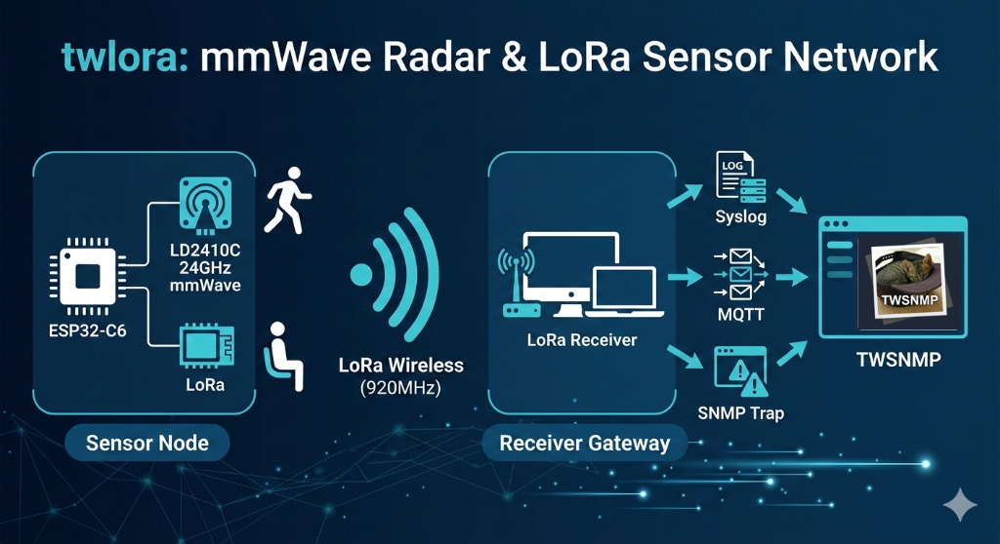

# twlora - TWSNMP LoRa Toolset

[English README](./README.md)

TWSNMPシリーズにおけるLoRa通信実験および、LoRaを用いたセンサーネットワーク構築のためのプログラム群です。



## 含まれるツール・プログラム

### 🛠 設定ツール
- **LoRa Config Tool (Go)**: PCからUSBシリアル経由でLoRaモジュールの周波数や出力を設定するツール。
- **LoRa Config Tool (Arduino)**: ESP32-C6を使用してLoRaモジュールの設定を行うツール。

### 📡 ファームウェア (Arduino)
- **Radar Sensor Transmitter (ESP32-C6)**: LD2410C 24GHz mmWave レーダーセンサーのデータを取得し、LoRa経由で送信するプログラム。
- **LoRa TxRx Test**: LoRa通信の疎通確認用ブリッジプログラム。

### 🖥 受信・統合 (Go)
- **twLoRaToLog**: LoRa経由で受信したデータを、syslogやMQTTなどのプロトコルへ中継・転送するプログラム。TWSNMPでの分析を想定しています。

## ビルドとセットアップ

このプロジェクトではツールの管理とビルドタスクの実行に [mise](https://mise.jdx.dev/) を使用しています。

### 準備
- `mise` をシステムにインストールしてください。
- このリポジトリの設定を信頼するように設定します：
  ```bash
  mise trust
  ```

### ビルド手順

1. **ツールのインストールとArduino環境のセットアップ**:
   ```bash
   mise install
   mise run arduino:setup
   ```

2. **全コンポーネントのビルド**:
   ```bash
   mise run build
   ```
   ビルドされたバイナリとファームウェアは `dist/` ディレクトリに保存されます。

3. **個別のタスク**:
   - Goプロジェクトのビルド: `mise run go:build` （`twLoRaToLog`, `twLoRaSetup` を生成）
   - レーダー用ファームウェアのコンパイル: `mise run arduino:compile:radar`
   - 設定用ファームウェアのコンパイル: `mise run arduino:compile:setup`

## 使用方法

### 🛠 twLoRaSetup (設定ツール)
USBシリアル経由でLoRaモジュールのパラメータを設定するためのGo言語製ユーティリティです。

**設定の読み取り:**
```bash
twLoRaSetup <ポート名>
# 例: twLoRaSetup /dev/tty.usbserial-1410
```

**設定の書き込み:**
```bash
twLoRaSetup <ポート名> <チャンネル> <アドレス>
# 例: 920MHz (チャンネル 920)、アドレス 1 に設定する場合
twLoRaSetup /dev/tty.usbserial-1410 920 1
```

### 🖥 twLoRaToLog (受信・転送ツール)
LoRaパケットを受信し、Syslog、MQTT、またはSNMP Trapへ転送する高機能レシーバーです。

**基本の使用方法:**
```bash
twLoRaToLog -port <ポート名> [オプション]
```

**主なオプション:**
- `-port`: シリアルポート名 (必須)
- `-syslog`: Syslog転送先 (例: `192.168.1.1:514`)
- `-mqtt`: MQTTブローカーURL (例: `tcp://localhost:1883`)
- `-mqttuser`: MQTTユーザー名
- `-mqttpassword`: MQTTパスワード
- `-snmp`: SNMP Trap転送先 (例: `192.168.1.1:162`)
- `-snmpcommunity`: SNMPコミュニティ名 (默认: `public`)
- `-snmpinterval`: SNMP Trap送信間隔（分） (デフォルト: `0` - すべて送信)
- `-list`: 利用可能なシリアルポートを一覧表示
- `-debug`: デバックモード (コンソールへのログ出力と検知時のビープ音)

**実行例 (SyslogとMQTTへ転送):**
```bash
twLoRaToLog -port /dev/tty.usbserial-1410 -syslog 192.168.1.100:514 -mqtt tcp://broker.hivemq.com:1883 -debug
```

## ビルドと書き込み

環境構築後、以下のいずれかの方法でファームウェアのビルドと書き込みを行ってください。

### 1. Arduino IDE (初心者向け)
1. [Arduino IDE](https://www.arduino.cc/en/software) をインストールします。
2. [XIAO ESP32C6 セットアップガイド](https://wiki.seeedstudio.com/xiao_esp32c6_getting_started/) を参考に、ESP32ボードのサポートを追加します。
3. **ライブラリマネージャー**から必要なライブラリをインストールします：
   - `ld2410` by Trevor Shannon
   - `EspSoftwareSerial`
4. プロジェクトディレクトリから `.ino` ファイル（例: `ESP32C6LoRaLD2410C/ESP32C6LoRaLD2410C.ino`）を開きます。
5. **ツール > ボード > esp32 > Seeed Studio XIAO ESP32C6** を選択します。
6. デバイスを接続し、**ツール > シリアルポート** で正しいポートを選択します。
7. **書き込み** ボタンをクリックします。

### 2. Arduino CLI (上級者向け)
`arduino-cli` がインストールされている場合 (`mise install` でインストール済みの場合):

```bash
# レーダーセンサー用
arduino-cli upload -p <PORT> --fqbn esp32:esp32:XIAO_ESP32C6 ESP32C6LoRaLD2410C

# 設定ツール用
arduino-cli upload -p <PORT> --fqbn esp32:esp32:XIAO_ESP32C6 ESP32LoRaSetup
```
*注意: `<PORT>` は実際のシリアルポート (macOS では `/dev/tty.usbmodem...`、Windows では `COMx` など) に置き換えてください。*

### 3. ESP32 Flash Download Tool (Windows GUI)
`dist/` ディレクトリにあるビルド済みバイナリを使用する場合:
1. [ESP32 Flash Download Tool](https://www.espressif.com/en/support/download/other-tools) をダウンロードします。
2. **ChipType: ESP32-C6** を選択します。
3. `dist/<component>/` からバイナリファイルを読み込みます:
   - `...bootloader.bin` を `0x0`
   - `...partitions.bin` を `0x8000`
   - `...ino.bin` を `0x10000`
4. **SPI SPEED** を **80MHz**、**SPI MODE** を **DIO** に設定します。
5. COMポートを選択し、**START** をクリックします。

### 4. esptool (コマンドライン)
[esptool.py](https://github.com/espressif/esptool) (`pip install esptool` でインストール可能) も使用できます:

```bash
esptool.py --chip esp32c6 --port <PORT> --baud 921600 write_flash 0x0 dist/radar/ESP32C6LoRaLD2410C.ino.bootloader.bin 0x8000 dist/radar/ESP32C6LoRaLD2410C.ino.partitions.bin 0x10000 dist/radar/ESP32C6LoRaLD2410C.ino.bin
```

## ライセンス
[Apache2](./LICENSE)
